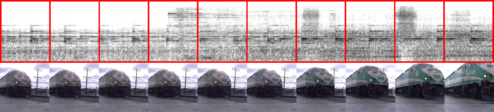

# s2i_data

Audiovisual data for Sound-to-Image (S2I) experiments.

1-s Mel spectrogram segments and respective central frames extracted from a video track of the class Rail transport

This dataset is made available under a [Creative Commons Attribution 4.0 International License][cc-by] [![CC BY 4.0][cc-by-shield]][cc-by]

[cc-by]: http://creativecommons.org/licenses/by/4.0/
[cc-by-image]: https://i.creativecommons.org/l/by/4.0/88x15.png
[cc-by-shield]: https://img.shields.io/badge/License-CC%20BY%204.0-lightgrey.svg
